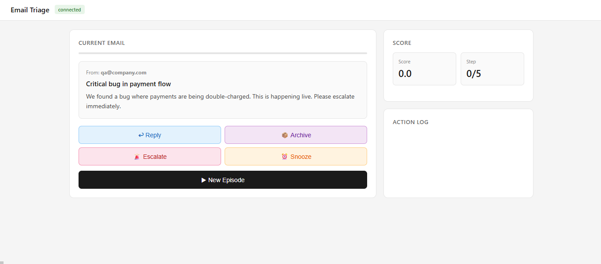
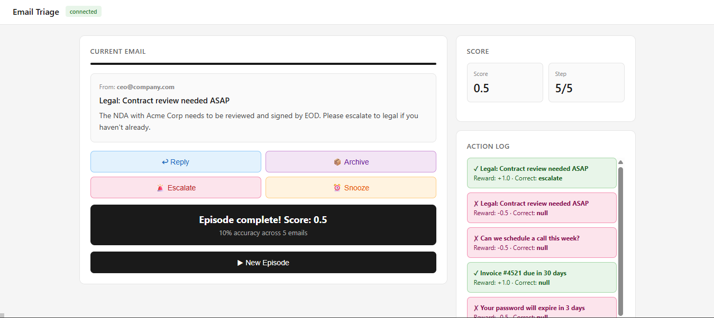

# 📩 Email Triage AI

An intelligent system that automatically classifies emails into actionable categories:

* 📬 Reply
* 🗂️ Archive
* ⚠️ Escalate
* ⏰ Snooze

---

## 🚀 Features

* FastAPI backend for real-time processing
* Rule-based email classification
* Interactive web UI for testing
* Docker support for deployment

---

## 📸 Demo Screenshots




---

## 🛠️ Tech Stack

* Python
* FastAPI
* Docker

---

## ▶️ Run Locally

```bash
pip install -r requirements.txt
python app.py
```

---

## 🐳 Run with Docker

```bash
docker build -t email-triage
docker run -p 7860:7860 email-triage
```

---

## 🎯 Use Case

This system helps automate email management by intelligently deciding what action should be taken on incoming emails, improving productivity and reducing manual effort.

---

## 🧠 How It Works

* Takes email content as input
* Analyzes keywords and context
* Predicts the best action (Reply / Archive / Escalate / Snooze)

---

## 🏆 Hackathon Project

Built as part of an AI/ML hackathon focused on solving real-world automation problems.

---

## 👨‍💻 Author

**Mohit J Gujjar**
GitHub: https://github.com/Mohitgujjar07
